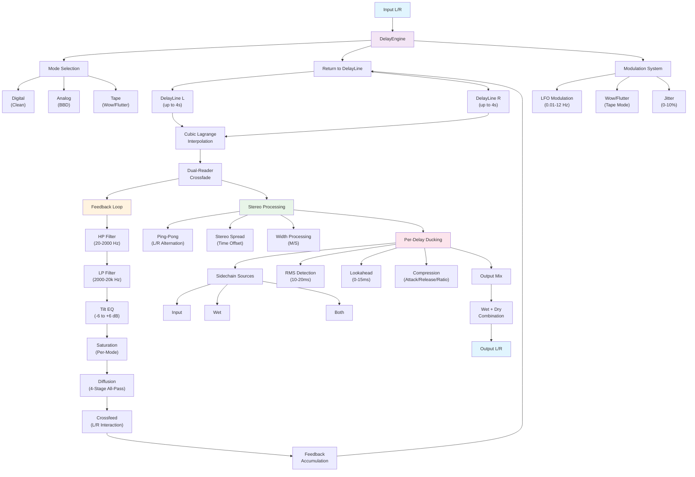

# FIELD — Professional Spatial & Imaging Processor

A modern spatial-imaging plugin built with JUCE. FIELD blends an expressive **XY Pad** (pan/depth), **multiband imaging** (per-band width + shuffler + rotation/asymmetry), tasteful **mono management**, **stereoize** options, **Brauer-style motion**, clear metering, and a **searchable preset system**—all under a consistent Look\&Feel and a maintainable codebase.

This README is optimized for **humans** and **AI builders**: explicit, actionable, and unambiguous.

---

## Contents

* [At a Glance](#at-a-glance)
* [Why FIELD](#why-field)
* [Feature Set](#feature-set)
* [Signal Flow](#signal-flow)
* [Parameters (APVTS IDs)](#parameters-apvts-ids)
* [UI / UX Spec](#ui--ux-spec)
* [Tabs & Pane System (NEW)](#tabs--pane-system-new)
* [Visualization Bus & Threading Model (NEW)](#visualization-bus--threading-model-new)
* [Preset System](#preset-system)
* [Meters & Visualization](#meters--visualization)
* [Build & Run](#build--run)
* [Project Structure](#project-structure)
* [Code & GUI Rules (Must-Follow)](#code--gui-rules-mustfollow)
* [Testing & QA Checklist](#testing--qa-checklist)
* [Roadmap](#roadmap)
* [Credits & License](#credits--license)

---

## At a Glance

* **Framework:** JUCE **7+** (works on 8), C++17
* **Formats:** VST3, AU, (optional AAX), Standalone
* **OS:** macOS & Windows, HiDPI ready
* **Pan Law:** **Ableton-accurate constant-power** (0 dB center, +3 dB at extremes)
* **UI:** Container-based, vector icon system, responsive scaling, fullscreen mode
* **Presets:** Searchable, categorized, A/B with copy, JSON storage
* **New Imaging:** 3-band width, shuffler (LF/HF emphasis), rotation, asymmetry
* **Safety:** Mono maker with slope + audition; stereoize mono-fold safety
* **Motion:** Brauer-style autopan (sync/free), depth, width, phase, center-bias
* **Meters:** L/R + M/S, correlation, mini vectorscope, waveform background

---

## Why FIELD

We drew from tools like **Basslane/Basslane Pro** (low-end mono & width treatment), **Waves S1** (rotation/asymmetry imaging), and **Brauer Motion** (animated movement) while keeping the **fast feel** of modern one-screen plugins. FIELD aims to be musical first, visual and predictable, and easy to automate.

---

## Feature Set

### XY Pad (Hero)

* **X:** Pan (Ableton-accurate)
* **Y:** Depth/Reverb intensity
* **Split mode:** Independent L/R points with **Link** & **Snap Grid**
* **Motion overlay:** Shows autopan path when enabled

### Imaging

* **3-Band Width:** Lo / Mid / Hi width with adjustable crossovers
* **Shuffler:** LF/HF emphasis & crossover for stereo perception
* **Rotation & Asymmetry:** S1-style field rotation and center offset
* **Accurate Curves:** RBJ biquad-magnitude visualization (HP/LP/Shelves/Peak) with soft-knee pixel mapping

#### Rotation & Asymmetry (details)

- **What it does**: Global Mid/Side rotation of the stereo field. It is not a pan or width control; it rotates the M/S vector by an angle and converts back to L/R. The transform is energy‑preserving (orthonormal).
- **Parameters**: `rotation_deg` (−45…+45, default 0), `asymmetry` (−1…+1, default 0).
- **Audible effect**:
  - **Positive rotation**: Injects Mid into Side → perceived wider, slightly less center focus.
  - **Negative rotation**: Injects Side into Mid → tighter/narrower, stronger center focus.
  - Designed to avoid overall loudness jumps.
- **DSP math** (applied only when there are ≥2 channels):

```
k  = 1/√2
θ  = radians(rotation_deg)
M  = k*(L + R)
S  = k*(L − R)
Mr = cos(θ)*M − sin(θ)*S
Sr = sin(θ)*M + cos(θ)*S
// Asymmetry: subtle crossfeed between rotated M and S
Mx = Mr + asymmetry * Sr * 0.15
Sx = Sr − asymmetry * Mr * 0.15
L  = k*(Mx + Sx)
R  = k*(Mx − Sx)
```

- **Placement in signal flow**: After per‑band width and shuffler; before Tone EQ (Tilt/Scoop/Bass/Air), Reverb, Delay, Stereoize, Mono Maker, and Saturation. See the Signal Flow section for the full chain.
- **Mono behavior**: Mono sum energy remains stable due to the orthonormal transform. Mono Maker runs later in the chain; low frequencies collapsed to mono are post‑rotation.
- **Automation**: Smooth and click‑free. Safe to automate across the full range.
- **UI**: In the Image row as “Rotation” and “Asymmetry.” A rotation pad in the XY visuals reflects the current rotation.

#### Rotation Pad Visualization

- **Energy circle (ring)**: The ring represents unit energy. Any point on it has the same overall energy, communicating that rotation is an orthonormal transform (no gain cheating).
- **Rotated basis (M/S → M′/S′)**: We draw the current rotated axes computed from the angle θ, with the axes labelled outside the ring as **M** (along M′) and **S** (along S′). A subtle dual tick on the rim marks θ.
- **S‑curve (Mid↔Side exchange)**: A cubic Bézier runs from −M′ rim to +M′ rim with end tangents aligned to ±S′. This visually encodes how Mid and Side exchange under rotation (reads as true M/S rotation, not pan).
- **Asymmetry shading**: A soft linear gradient is applied within the circle along the S′ axis. The tint intensity scales with |asymmetry|, and its direction flips with the sign of asymmetry (heavier tint toward +S′ for positive values, toward −S′ for negative).
- **Design notes**: No background panel—only the ring, axes, gradient, and S‑curve—keeps focus and avoids “right‑leaning pan” cues while conveying both orthonormal rotation and directional bias.

Plain terms

- Clockwise rotation (θ > 0): The stereo image feels wider and slightly less centered. The S‑curve bows toward the +S side and the rim tick sits at a positive angle. With Asymmetry, the gradient tint is stronger toward +S.
- Counterclockwise rotation (θ < 0): The image tightens/narrows with more center focus. The S‑curve bows toward the −S side and the rim tick sits at a negative angle. With Asymmetry, the gradient tint is stronger toward −S.
- Constant energy: The ring stays the same size because rotation is energy‑preserving; you’re rebalancing Mid/Side, not changing overall loudness.

### Mono Management

* **Mono Maker:** Sums under a cutoff with selectable **slope (6/12/24 dB/oct)**
* **Audition:** Listen to “what’s being mono’d” for confidence checks
 
### Phase Modes (NEW)

FIELD now supports phase behaviors for the core high‑pass / low‑pass and tone path:

- **Zero**: Current minimum‑phase IIR path. Zero added latency. Default.
- **Natural**: Minimum‑phase IIR with gentle HF guards (wider stability near Nyquist). Zero latency. Musical transient feel.
- **Hybrid Linear**: Linear‑phase HP/LP via FIR (overlap‑save), while shelves/tilt/peaks remain IIR. Host latency is reported automatically.
- **Full Linear**: One composite linear‑phase FIR replaces HP/LP + Tilt/Bass/Air/Scoop in a single convolver. Magnitude matches the macro tone; phase is strictly linear. Host latency is reported automatically.

Notes:
- Hybrid Linear primarily de‑warps the most audible phase rotations of the macro slopes. It preserves the tone of your shelves/peaks for a balanced hybrid response.
- Full Linear synthesizes one FIR from the desired magnitude response (HP/LP + Tilt/Bass/Air/Scoop sampled on a dense grid), IFFTs to time, windows, and truncates to odd length N. Transients stay pristine; latency is fixed.
- Reported latency ≈ (N−1)/2 samples. Default `4097` taps → ~42.7 ms @ 48 kHz (8193 → ~85.4 ms).
- HP/LP cutoffs remain clamped: HP ≤ 1 kHz, LP ≥ 1 kHz, and HP < LP.
- Natural mode adds subtle HF safety when designing shelves/peaks near Nyquist.

### Stereoize (P1)

* **Algorithms:** Haas, All-Pass, MicroPitch
* **Mono safety:** Delay/time clamped vs. mono cutoff to prevent combing on fold-down

### Motion (Brauer-Style)

* **Shapes:** Sine, Triangle, Square, Random
* **Sync/Free:** DAW-sync divisions & free Hz rates
* **Depth/Width/Phase/Center Bias** + optional **band-limited** motion

### Delay System (NEW - Professional Grade)

* **Three Delay Modes:** Digital (clean), Analog (BBD-style), Tape (wow/flutter)
* **Stereo Processing:** Independent L/R delay lines with crossfeed and ping-pong
* **Tempo Sync:** Musical divisions with dotted/triplet support via compact S/D/T selector (1/64T to 2/1)
* **Modulation:** LFO-based chorus, wow/flutter, and jitter for movement
* **Tone Shaping:** HP/LP filters, tilt EQ, saturation in feedback loop
* **Diffusion:** 4-stage all-pass chain for reverb-like effects
* **Per-Delay Ducking:** Independent sidechain with attack/release/threshold/ratio; smart Source with External (SC) support
* **Glitchless Time Changes:** Dual-reader crossfade prevents pops/clicks
* **High-Quality Interpolation:** Cubic Lagrange for smooth modulation
* **Feedback Safety:** Hard limits and auto-reduction for stability

### Presets

* **Searchable** by text, **categorized**, **A/B** with **Copy A↔B**, JSON storage

### Visuals & Meters

* **Correlation**, **mini vectorscope**, **L/R bars**, **waveform background**
* **EQ curves:** HP/LP, Tilt, Air, Scoop/Boost — true RBJ magnitude; neutral at HP=20 Hz and LP=20 kHz
* **Rulers & Grid:** dB ruler (±18 dB with soft mapping) and Pan subgrid (every 5 units, 50L…0…50R)

---

## Imager (Field)

> This section documents the **Imager** system in Field: what it shows, how it processes, how to use each control, and how the visuals relate to the audio. Items marked **[COMING]** are implemented in the design and under active development.

---

### Quick start

* Open the **Imager** tab.
* Use **Global Width** to gently widen or narrow the stereo image; then refine with **Low/Mid/High Width** and the two **Crossovers**.
* Use **Shuffler** for additional low/high emphasis (classic “airier top / safer lows”).
* Keep lows stable with **Mono Maker** (Hz + slope).
* Use **Rotation** and **Asymmetry** for final placement/balance.
* Watch the **Heatmap** [COMING]: warm tiles warn of mono risk; cool tiles are safe.
* Switch to **Width Designer** mode [COMING] for frequency-tilted width, auto-width protection, and a floating control panel.

---

### Signal flow (audio)

The Imager operates purely in the stereo domain. In **Hybrid Linear** phase mode, the FIR HP/LP introduces a fixed group delay that is reported to the host; other modes incur no extra latency.

```
[Input L/R]
   └─► (optional HP/LP & tone from main chain)
        ├─► 3-Band Split (Lo/Mid/Hi) ─► Per-Band Width
        ├─► Shuffler 2-Band (LF/HF) width
        ├─► Rotation & Asymmetry
        ├─► Mono Maker (variable slope)
        └─► (remainder of chain: non-linearities, FX, sum)
[Output L/R]
```

**[Designer Mode COMING]** inserts:

* **Side-Tilt Width** (S-only shelving tilt around a pivot) before Rotation/Asym.
* **Auto-Width Clamp** (dynamic protection) after all MS manipulations.

Internally, mid/side uses the constant-power convention:

* `M = (L + R) / √2`
* `S = (L − R) / √2`

---

### Visuals (Imager tab)

#### Heatmap (Time × Frequency correlation) [COMING]

* **What**: a scrolling heatmap of **stereo correlation** per log-frequency band.

  * r = +1 (fully correlated, mono-safe) → **cool** colors
  * r = 0 (decorrelated) → **neutral grey**
  * r = −1 (inverted / collapse-prone) → **hot** colors
* **How it’s computed**

  * Short STFT (default **2048** samples, **50%** hop), Hann window.
  * Bins grouped into log bands (default **1/3-octave**, ~32 bands).
  * Pearson r per band: zero‑lag normalized cross-spectrum, gated on energy, asym-smoothed; columns written into a circular `juce::Image` (no allocation in `paint()`).
* **Interactions**

  * **Click a tile** → solo that band (routes to your existing Lo/Mid/Hi preview) [COMING].
  * **Drag crossovers** on the heatmap; guides match your LO/MID/HI split.
  * **Freeze**: stop the writer to A/B; **Show PRE**: faint overlay of input [COMING].
* **Performance**: analysis runs on the **UI timer** when the Imager tab is active (or “Keep Warm” is on). Painting is a blit plus guides.

> Tip: use the heatmap to find **where** widening is risky (hot bands) and address with **Mono Maker**, **per-band Width**, or **Auto-Width** in Designer mode.

---

### Controls & what they do

#### Global & Per-Band Width

* **Width** (0.5…2.0): scales **S** globally.
* **Width Low / Mid / High** (0…2.0): per-band **S** scaling after a **3-band split**:

  * **XO Lo (Hz)**: Linkwitz-Riley LP cutoff for Low.
  * **XO Hi (Hz)**: Linkwitz-Riley HP cutoff for High.
  * **Mid** = Full − Low − High (phase-coherent).
* **Best practice**: keep **Low ≤ 1.0**, especially for kick/bass. Use **Mid/High > 1.0** to add width without jeopardizing mono.

#### Shuffler (2-band)

Classic psychoacoustic imager:

* **Shuffler Low % / High %** (0…200): extra S emphasis **below/above** **Shuffler XO**.
* The split is LF via LR LP at XO; HF = full − LF. Each band’s S is scaled independently.
* **Use**: add airy “sparkle” (**HF**) and/or subtle LF spaciousness (**LF**). Keep LF modest to avoid mono drift.

#### Rotation & Asymmetry

* **Rotation (deg)**: rotates **M/S** (a mid/side “pan”); small values re-balance width vs center energy.
* **Asymmetry** (−1…+1): tiny cross-feed in M/S; nudges perceived balance without a hard pan.

#### Mono Maker

* **Mono (Hz)**: below this, L/R are summed to mono and blended with the highs.
* **Slope**: 6/12/24 dB/oct via a Butterworth bank—steeper = firmer mono region.
* **Mono Audition**: monitor only what will be mono’d (diagnostic).

---

### Width Designer mode [COMING]

A smarter, safer way to widen that respects frequency and program material.

#### Side-Tilt Width

* **Side Tilt (dB/oct)** (−6…+6): applies a complementary **low/high shelf pair to S** around a pivot, approximating a tilt slope across ~3 octaves.

  * Positive = **more width up high**, **less down low** (preferred).
  * Negative = inverse.
* **Tilt Pivot (Hz)**: where the tilt “seesaws.” Typical **600–900 Hz**.
* **Why**: preserves punch and mono stability while opening air and presence.

#### Auto-Width (dynamic clamp)

* **Depth** (0…1): maximum amount of **S reduction** when the signal becomes risky.
* **Threshold (S/M dB)**: when the **Side-to-Mid ratio** exceeds this, clamping engages.
* **Attack / Release (ms)**: how fast it protects and how smoothly it recovers.
* **Max Width** (0.5…2.5): absolute S ceiling (safety net).

How it works:

1. Measure block RMS of `M` and `S`, compute `S/M` in dB.
2. If above Threshold, reduce S by up to Depth (smoothed with Attack/Release).
3. Apply **Max Width** cap to prevent overshoots.
4. Reconstruct L/R from the adjusted M/S.

> **Starting point**: Depth 0.4, Threshold −3 dB, Attack 25 ms, Release 250 ms, Max 2.0.

#### Floating “Width Designer” panel [COMING]

* A draggable, resizable sub-panel with:

  * Mode (Classic / Designer)
  * Side Tilt (dB/oct), Pivot (Hz)
  * Auto-Width: Depth, Threshold, Attack, Release
  * Max Width
  * Live meter: current auto-width gain, plus S/M bar [COMING]
* Bounds persist (e.g., `ui_widthpanel_bounds`), always-on-top for quick tweaks.

---

### Visual settings (Imager)

* **Quality** (15/30/60 fps) [COMING]: sets heatmap column cadence and UI timer.
* **Show PRE** [COMING]: renders a faint pre-processing heatmap under the post image.
* **Freeze** [COMING]: pauses updates for A/B and screenshots.
* **Keep Warm** (Tabs menu): keeps analyzers running when Imager is not visible.

---

### Developer notes (algorithms & implementation)

* **3-Band Width**: LR 4th-order Linkwitz-Riley LP@Lo, HP@Hi; Mid derived by subtraction (phase-coherent). Per-band width scales S and resums LR.
* **Shuffler**: single LR lowpass @ XO to split LF; HF = full − LF; width per band; cheap and effective.
* **Rotation**: M/S rotation by angle θ (energy-preserving); see Rotation details above.
* **Asymmetry**: gentle cross-mix in M/S to bias perceived center/edge.
* **Mono Maker**: 1st/2nd/4th-order Butterworth LP on each channel → mono’d lows; highs passthrough; recombine.
* **Designer Side-Tilt**: complementary low/high shelves on **S** with S-shape ~0.9, placed around Pivot (~0.6× / 1.6×), gains derived from **dB/oct × span (~3 oct)**.
* **Auto-Width**: measures `S/M (dB)`, computes target gain, smooths per-sample with separate Attack/Release one-poles, then applies to S; clamps to **Max Width**.
* **Heatmap**: STFT 2048/50% Hann, 1/3‑oct banding, Pearson r, energy-gate with hysteresis, per-band exp smoothing; column written into a circular `juce::Image`; diverging color ramp (color-blind-safe). Columns can burst up to 2 per tick to reduce lag.

**Threading**

* Audio DSP is all in the audio thread; analyzers/heatmap run on the UI timer; painting is lock-free (blit + guides).
* Visualization buses `visPre`/`visPost` are SPSC ring buffers.

---

### Practical recipes

* **Widen the top, keep lows glued**

  * Width: **Low 0.9**, Mid 1.1, High 1.2; XO: 150 Hz / 2 kHz.
  * Shuffler: LF 90–100%, HF 110–120%, XO ~700 Hz.
  * Mono Maker: 90–120 Hz @ 12 dB/oct.
  * **Designer**: Side Tilt **+2.5 dB/oct @ 700 Hz**, Auto-Width Depth 0.35, Thr −3 dB.

* **Fix swirly chorus collapse**

  * Watch Heatmap for hot HF bands; reduce **High Width** to ~1.0–1.1 and enable **Auto-Width** (Depth 0.5).
  * Consider small **Rotation** (+/− 3–5°) to rebalance.

* **Make a narrow verse bloom on the chorus**

  * Automate **Global Width** 0.9 → 1.3; in Designer, increase Side Tilt during the chorus.

---

### Safety & best practices

* **Mono first**: set **Mono Maker** early; confirm with **Mono Audition**.
* **Lows ≤ 1.0**: resist widening subs/kick; use the shuffler sparingly in LF.
* **Use Designer Auto-Width** when pushing High/Mid > 1.2; it’s a graceful seatbelt.
* **Heatmap**: hot, stable bands are where collapse risk hides—address them with tilt or mono cutoff.
* **Gain staging**: widening increases peak S; the **Max Width** cap can prevent spiky transients.

---

### UI & persistence

* All Imager options persist in the session. Proposed keys:

  * `ui_activePane="imager"`, `ui_shade_imager`, `ui_keepWarm`
  * `ui_imager_mode` (Heat/… [COMING]), `ui_imager_quality`, `ui_imager_showPre`, `ui_imager_freeze`
  * `ui_widthpanel_bounds` (floating panel geometry)

---

### Known limitations / roadmap

* Heatmap PRE overlay, Freeze, and Quality switcher **[COMING]**.
* Floating Width Designer panel & live meters **[COMING]**.
* Optional correlation-weighted auto-width (use **r** instead of S/M) **[COMING]**.
* Per-band auto-width (Lo/Mid/Hi independent detectors) **[COMING]**.
* Side-exciter (HF saturation on S only) **[COMING]**.

---

### Glossary

* **Width**: scale of the **S** (side) channel; >1 widens, <1 narrows.
* **Shuffler**: band-dependent S emphasis; classic imager trick.
* **Rotation**: mid/side rotation that shifts energy between M and S.
* **Asymmetry**: small bias in M/S to shift perceived center vs edges.
* **Mono Maker**: sums lows to mono below a cutoff with a chosen slope.
* **Correlation (r)**: similarity of L and R (−1..+1), mono safety proxy.
* **S/M (dB)**: level ratio of side to mid; a proxy for “how wide”.

---

---

## Signal Flow

```
[Input L/R]
 → Pre-EQ: HP / LP / Tilt / Bass / Scoop / Air (HP/LP bypassed when neutral: HP≤20 Hz and LP≥20 kHz)
 → Band-Split (LR24): xover_lo_hz, xover_hi_hz
    → Per-Band M/S Width (Lo/Mid/Hi)
    → Shuffler LF/HF (with shuffler_xover_hz)
 → Global M/S: Rotation, Asymmetry
 → Reverb (wet-only) → Wet Ducking (look-ahead RMS, sidechain=dry)
    ├── Dry bus ─────────────────────────────────────────────┐
    └── Wet bus (100% wet, scaled by depth) → Look-Ahead DUCKER →┘
 → Sum (Dry + Wet)
 → DELAY PROCESSING (NEW):
    ├── Mode Selection (Digital/Analog/Tape)
    ├── Dual Delay Lines (L/R) with Cubic Lagrange Interpolation
    ├── Modulation (LFO + Wow/Flutter + Jitter)
    ├── Feedback Loop: HP → LP → Tilt → Saturation → Diffusion → Crossfeed
    ├── Stereo Processing (Ping-Pong, Spread, Width)
    └── Per-Delay Ducking (optional, independent of global duck)
 → Stereoize (Haas/AP/MicroPitch) + mono safety
 → Mono Maker (below mono_hz, slope, audition tap)
 → Saturation (Drive/Mix)
 → Output L/R

Meters tap at safe points (LR+MS peaks, correlation, scope feed).
```

---

## Parameters (APVTS IDs)

> **IDs are snake\_case.** Values normalized in UI; APVTS stores normalized. Only the **relevant & current** set is listed.

**Core / Existing (shipping)**
**Phase / Quality**

- `phase_mode`: Choice { Zero, Natural, Hybrid Linear, Full Linear } — controls the tone path. Hybrid: FIR HP/LP only. Full Linear: composite FIR for HP/LP+tone. Both report latency ((N−1)/2 samples).

* `gain_db` (-12…+12, 0), `sat_drive_db` (0…36, 0), `sat_mix` (0…1, 1), `bypass` (0/1, 0)
* `width` (0.5…2.0, 1.0), `pan` (-1…+1, 0), `pan_l` / `pan_r` (split), `split_mode` (0/1, 0)
* `space_algo` (Room/Plate/Hall, Room), `depth` (0…1, 0.0), `ducking` (0…1, 0), `os_mode` (Off/2x/4x)
  - Reverb macro: depth drives Mix, Size, Damping, Width with type‑voiced curves
* Ducking advanced: `duck_threshold_db` (-60..0), `duck_knee_db` (0..18), `duck_ratio` (1..20), `duck_attack_ms` (1..80), `duck_release_ms` (20..800), `duck_lookahead_ms` (0..20), `duck_rms_ms` (2..50), `duck_target` (WetOnly/Global)
* `hp_hz` (20…1000, 20), `lp_hz` (1000…20000, 20000) — bypassed at extremes
* `tilt` (-12…+12, 0), `air_db` (0…6, 0), `bass_db` (-12…+12, 0), `scoop` (-12…+12, 0)
* (Mini-sliders) `tilt_freq` (100…1000), `scoop_freq` (200…2000), `bass_freq` (50…500), `air_freq` (2k…20k)

**Imaging (NEW)**

* `xover_lo_hz` (40…400, **150**)
* `xover_hi_hz` (800…6000, **2000**)
* `width_lo` (0…2, **1.0**), `width_mid` (0…2, **1.0**), `width_hi` (0…2, **1.1**)
* `rotation_deg` (-45…+45, **0**), `asymmetry` (-1…+1, **0**)
* `shuffler_lo_pct` (0…200, **100**), `shuffler_hi_pct` (0…200, **100**), `shuffler_xover_hz` (150…2000, **700**)

**Delay System (NEW)**

* `delay_enabled` (0/1, **0**) — Master delay enable/disable
* `delay_mode` (Digital/Analog/Tape, **Digital**) — Delay character mode
* `delay_sync` (0/1, **1**) — Tempo sync vs free time
* `delay_time_ms` (1…4000, **350**) — Free time in milliseconds
* `delay_time_div` (1/64T…2/1D, **1/4**) — Musical division when synced
* `delay_feedback_pct` (0…98, **36**) — Feedback amount (hard-limited <99%)
* `delay_wet` (0…1, **0.25**) — Delay wet level
* `delay_kill_dry` (0/1, **0**) — Kill dry signal (wet only)
* `delay_freeze` (0/1, **0**) — Freeze delay (input muted, 100% feedback)
* `delay_pingpong` (0/1, **0**) — Ping-pong between L/R channels
* `delay_crossfeed_pct` (0…100, **35**) — L/R crossfeed amount
* `delay_stereo_spread_pct` (0…100, **25**) — Stereo time spread (L earlier/R later)
* `delay_width` (0…2, **1.0**) — Delay wet width processing
* `delay_mod_rate_hz` (0.01…12, **0.35**) — LFO modulation rate
* `delay_mod_depth_ms` (0…12, **3.0**) — LFO modulation depth (Digital/Analog)
* `delay_wowflutter` (0…1, **0.25**) — Tape wow/flutter amount (Tape mode)
* `delay_jitter_pct` (0…10, **2**) — Random time jitter percentage
* `delay_hp_hz` (20…2000, **120**) — Feedback loop high-pass filter
* `delay_lp_hz` (2000…20000, **12000**) — Feedback loop low-pass filter
* `delay_tilt_db` (-6…+6, **0**) — Feedback loop tilt EQ
* `delay_sat` (0…1, **0.2**) — Feedback loop saturation amount
* `delay_diffusion` (0…1, **0**) — All-pass diffusion amount (0=off)
* `delay_diffuse_size_ms` (5…50, **18**) — All-pass diffusion time spread
* `delay_duck_source` (Input/Wet/Both, **Input**) — Ducking sidechain source
* `delay_duck_post` (0/1, **1**) — Duck post-wet vs pre-wet
* `delay_duck_depth` (0…1, **0.6**) — Ducking depth amount
* `delay_duck_attack_ms` (1…200, **12**) — Ducking attack time
* `delay_duck_release_ms` (20…1000, **220**) — Ducking release time
* `delay_duck_threshold_db` (-60…0, **-26**) — Ducking threshold level
* `delay_duck_ratio` (1…8, **2**) — Ducking compression ratio
* `delay_duck_lookahead_ms` (0…15, **5**) — Ducking lookahead time
* `delay_duck_link_global` (0/1, **1**) — Link to global ducking settings

**Stereoize**

* `stereoize_enabled` (0/1, **0**)
* `stereoize_algo` (Haas/AllPass/MicroPitch, **Haas**)
* `stereoize_time_ms` (0…20, **6.0**) (Haas)
* `stereoize_ap_amount` (0…1, **0.5**) (AllPass)
* `stereoize_detune_cents` (0…15, **5**) (MicroPitch)

**Mono Maker**

* `mono_hz` (0…300, **120**)
* `mono_slope_db_oct` (6/12/24, **12**)
* `mono_audition` (0/1, **0**)

**Motion**

* `autopan_enabled` (0/1, **0**)
* `autopan_shape` (Sine/Tri/Square/Random, **Sine**)
* `autopan_sync` (Sync/Free, **Sync**)
* `autopan_rate_hz` (0.01…20, **0.5**)
* `autopan_rate_div` (1/4, 1/2, 1/1, 2/1, 4/1, **1/2**)
* `autopan_depth` (0…1, **0.6**), `autopan_width` (0…1, **1.0**)
* `autopan_phase_deg` (0…180, **0**), `autopan_center_bias` (-1…+1, **0**)
* `autopan_filter_hp` (20…500, **20**), `autopan_filter_lp` (2k…20k, **20000**)

**Meters (read-only)**

* `meter_corr` (-1…+1), `meter_lr_peak`, `meter_ms_peak`, `scope_feed_x/y`, `duck_gr_db` (live GR dB)

**Pan Law (spec)**

* Sinusoidal constant-power crossfade, center = 0 dB, extremes = +3 dB.
* Split mode exposes `pan_l` / `pan_r` internally (UI presents as L/R balls).

---

## UI / UX Spec

### Layout (Containers)

* **Header:** Bypass, Preset combo (searchable), Prev/Next, Save, A/B with Copy, Split, Link, Snap Grid, Color Mode, Fullscreen.
* **Hero:** **XY Pad** (pan/depth) with split markers; waveform background; motion path overlay.
* **Right Strip:** Vertical meter panel with correlation meter (top) and L/R meters (bottom).
* **Bottom Rows:**

  * **Volume row:** Pan (3x), Width, W LO, W MID, W HI, Gain, Mix, Wet Only. Reverb Depth + Algo and Ducking (DUCK/ATT/REL/THR/RAT) sit on Row 2 with Mono at the front.
    - Ducking controls are size L and fully labeled; DUCK shows 0–100%.
    - DUCK knob renders a secondary arc indicating live gain reduction.
  * **EQ row:** Bass, Air, Tilt (+ mini-freq sliders), HP, LP, Mono.
  * **Image row:** Width Lo/Mid/Hi, Rotation, Asymmetry, Shuffler, Stereoize card.
* **Right Side Card:** **Delay Module** — 4×7 grid, panel-styled cells with unified spacing:
  - **Row 1 — Switches/Combos:** Enable, Mode, Sync, S/D/T (grid flavor), Ping-Pong, Freeze, Kill Dry
  - **Row 2 — Time & Mod:** Time, Feedback, Mix, Rate, Depth, Spread, Width
  - **Row 3 — Tone:** Saturation, Diffusion, Size, HP, LP, Tilt, Wow/Flutter
  - **Row 4 — Ducking:** Duck Source (In Pre/Post/External), Post, Threshold (THR), Depth, Attack (ATT), Release (REL), Lookahead (LA)

### Look & Feel

* Single **Look\&Feel** (`FieldLNF`) owns colors/gradients/shadows.
* **Color Modes:** Ocean (default), Green, Pink, Yellow, Grey. Use the palette button in the header to cycle modes; visuals are driven entirely by `FieldLNF::theme`.
* Vector **icon language** (20+ icons): Lock/Save/Power/Options, Pan/Reverb/Width/Tilt, HP/LP/Drive/Mix/Air, Link/Stereo/Split/Fullscreen, Help.
* Centered value labels below knobs; responsive scaling (≈50–200%); fullscreen toggle.

### Layout Tokens (Source/Layout.h)

All layout metrics and sizes are centralized in `Source/Layout.h`. Use these exclusively; avoid magic numbers in `resized()` and `paint()`.

- Spacing: `Layout::PAD`, `PAD_S`, `PAD_L`, `GAP`, `GAP_S`, `GAP_L`
- Corners/lines: `RADIUS_S`, `RADIUS`, `RADIUS_L`, `DIVIDER_THICK`
- Breakpoints: `BP_WIDE`, `BP_NARROW`
- Knobs: `Layout::Knob::{S, M, L, XL}` with `Layout::knobPx()` and helper `Layout::sizeKnob()`
- Header: `HEADER_H`, `HEADER_ROW_H`, `HEADER_PRESET_W`, `HEADER_SPLIT_W`
- XY/meters: `XY_MIN_H`, `METERS_W`, `CORR_METER_H`
- Rows/labels: `ROW_SPACER_H`, `LABEL_BAND_TOP`, `LABEL_BAND_EXTRA`
- Micros: `MICRO_W`, `MICRO_H` with `Layout::sizeMicro()`
- Special: `ALGO_SWITCH_W`
- Combo/Menu: `Layout::Combo::{H, W_MIN, PRESET_W}`, `Layout::Menu::{ITEM_H, SEP_PAD, CORNER_R}`

DP helper: `Layout::dp(px, scale)`; always scale sizes with the editor `scaleFactor`.

### Fullscreen Behavior

- The header fullscreen button toggles the top-level window via JUCE’s `ResizableWindow::setFullScreen(true/false)`.
- On enter: the current window bounds are saved; the window expands to fill the display.
- On exit: fullscreen is turned off and the original bounds are restored exactly.
- Safety: if the host/DAW does not allow fullscreen, the toggle is cancelled to avoid bad states.
- Scope: intended primarily for the Standalone build. In plugin hosts, behavior depends on the host’s windowing rules.

---

## Tabs & Pane System (NEW)

FIELD’s main view is organized into three panes accessible via tabs:

- **XY**: The hero XY Pad with the time‑domain oscilloscope overlay.
- **Spectrum**: High‑resolution spectrum analyzer with optional pre overlay and EQ curve.
- **Imager**: Placeholder (future) for advanced image field tools.

### Architecture

- **PaneManager (`Source/ui/PaneManager.h`)** controls tab selection, child visibility, and a lightweight UI‑thread timer used for visualization polling.
- A “Keep Warm” option allows Spectrum to continue receiving data while inactive for instant visuals when switching in; otherwise Spectrum sleeps while not visible.
- On tab switches, Spectrum’s analyzer is explicitly gated (`pauseAudio`/`resumeAudio`) to avoid lifetime races.

### First‑Paint Behavior & Safety

- Spectrum shows a **grid‑only fallback** until a full, valid FFT frame is ready. This prevents any draw‑time crashes on first activation or when no audio is present.
- XY oscilloscope is fed on the UI thread via the pane manager and always renders safely on first load.

### UX Notes

- Switching tabs is glitch‑free and does not affect audio processing. Only visualization feeds are paused/resumed.
- The Imager tab is currently a placeholder component; its activation is safe and has no audio side‑effects.

---

## Visualization Bus & Threading Model (NEW)

To eliminate audio→UI lifetime risks, FIELD uses a **processor‑owned, lock‑free visualization bus** (SPSC ring) and a **UI pull** model.

### Key Pieces

- **VisBus (processor)**: Lives in `PluginProcessor`. The audio thread writes recent L/R samples into a single‑producer ring buffer with zero locks. Overflow safely drops (no blocking).
- **PaneManager pull (UI)**: On a lightweight UI timer, small chunks are pulled from `visPre`/`visPost` and forwarded into `SpectrumAnalyzer::pushBlock/Pre`.
- **Analyzer gating**: `acceptingAudio` atomically pauses/resumes feed during configure and tab switches. Configure operations use a short `cfgLock` and flip `postConfigured` only when ready.
- **Frame flags**: `postFrameReady`/`preFrameReady` turn true only after a complete smoothed frame. Paint uses a `SpinLock` try‑lock; if busy or not ready, it draws the grid only.

### Invariants

- No audio thread calls into UI objects or captures UI ownership via lambdas.
- No blocking or dynamic allocations on the audio thread.
- Spectrum paint path never dereferences half‑configured state (strict preconditions; grid fallback).

### Results

- You can safely click the Spectrum tab with or without audio running.
- First activation shows the grid; the spectrum draws as soon as the first valid frame arrives.

---

## Preset System

* **Searchable**: type-to-search by name, description, author, category.
* **Categories**: Studio, Mixing, Mastering, Creative (+ user categories).
* **A/B with Copy**; **JSON** storage in user-data app folder (platform-appropriate).
* Ships with a **starter bank** (e.g., *Low Anchor*, *Wide Air*, *Club*, *Brauer Glide*, *Motion ∞*).

---

## Meters & Visualization

* **Waveform background** with elegant thin lines (direction configurable).
* **EQ curves:** HP/LP (blue), Tilt (orange dashed), Air (white).
* **Drive visualization** with fine lines.
* **Pan split borders** show L/R split percentage.
  - **CORR**: -1…+1 centered bar (neg=left/red, pos=right/green).
  - **L/R bars**: stacked horizontal meters with RMS fill and peak marker; near-clip turns red; dB ticks at -24/-12/-6/-3/-1 dBFS.
  - Scaled 0..1 (linear) with dB-to-gain mapping for tick placement. Values smoothed per block for stable visuals.

---

## Delay System Technical Specification

FIELD's delay system is a professional-grade implementation designed for musical applications, featuring three distinct character modes, comprehensive modulation, and advanced stereo processing.

### Core Architecture

**Delay Line Engine**
- **Dual DelayLine**: Independent L/R processing with up to 4 seconds maximum delay time
- **Cubic Lagrange Interpolation**: High-quality fractional delay for smooth modulation without artifacts
- **Dual-Reader Crossfade**: Glitchless time changes using 20ms linear crossfade between old/new delay times
- **Automatic Safety**: Hard-limited feedback (<99%) with auto-reduction when saturation/diffusion high

**System Architecture Diagram**



**Three Delay Modes**
- **Digital**: Clean, flat frequency response with chorus-style modulation
- **Analog (BBD)**: Gentle high-frequency rolloff per repeat, subtle noise, soft-saturating feedback
- **Tape**: Tilt EQ boost, wow/flutter (dual-rate LFO), asymmetric saturation, head-bump simulation

### Signal Processing Chain

**Per-Channel Processing**
```
Input → Write to DelayLine → Read (interpolated) → Feedback Loop → Output Mix
                                                      ↓
                                    HP → LP → Tilt → Saturation → Diffusion → Crossfeed
                                                      ↑
                                            Feedback accumulation
```

**Modulation System**
- **LFO Modulation**: Single sine wave LFO for Digital/Analog modes (0.01-12 Hz, 0-12ms depth)
- **Tape Wow/Flutter**: Dual-rate LFO blend (~0.3-1.2 Hz wow + ~5-8 Hz flutter) with mechanical noise
- **Jitter**: Random time variations (0-10% of base delay time) for vintage character
- **Tempo Sync**: Full musical divisions; S/D/T segmented selector applies dotted/triplet multipliers

**Stereo Processing**
- **Ping-Pong**: True L/R alternation with high crossfeed (~1.0) and channel swapping
- **Stereo Spread**: Time offset between L/R channels (L = time × (1-spread), R = time × (1+spread))
- **Crossfeed**: Controllable L/R interaction (0-100%) for stereo width control
- **Width Processing**: M/S processing on delay output with FIELD's width law integration

**Tone Shaping (Feedback Loop)**
- **HP/LP Filters**: State Variable TPT filters (HP: 20-2000 Hz, LP: 2000-20000 Hz)
- **Tilt EQ**: Broad shelf EQ in feedback path (-6 to +6 dB)
- **Saturation**: Per-mode soft clipping (tanh for Digital, asymmetric for Tape, gentle knee for Analog)
- **Diffusion**: 4-stage all-pass chain (5-50ms spread) with 0.6-0.8 gain for reverb-like smearing

### Per-Delay Ducking System

Independent ducking system separate from global ducking, with full parameter control:

**Sidechain Sources (UI: Duck Source)**
- **In (Pre)**: Detector listens to dry input before delay (classic vocal-duck feel)
- **In (Post)**: Detector listens post-wet (self-duck/pumpy FX)
- **External (SC)**: Host sidechain bus; auto-fallback to In (Pre) if no SC present

**Post Toggle Behavior**
- Post is meaningful with In-source only. When External (SC) is selected, Post is disabled in the UI.

**Processing**
- **RMS Detection**: 10-20ms RMS window with optional lookahead (0-15ms)
- **Soft-Knee Compression**: Attack (1-200ms), Release (20-1000ms), Ratio (1:1-8:1)
- **Insertion Point**: Pre-wet or post-wet processing with depth control (0-100%)
- **Global Linking**: Optional multiplication with global duck settings

**Recommended Defaults**
- Source: In (Pre), Post: Off
- Threshold: ≈ -24 dBFS, Depth: 6–10 dB, Attack: 5–10 ms, Release: 150–300 ms
- Lookahead: 3–5 ms (if available)

### Safety and Stability

**Feedback Protection**
- Hard limit at 98% feedback to prevent runaway oscillation
- Auto-reduction when diffusion + saturation create instability
- DC blocking filter (10 Hz high-pass) in feedback loop
- Denormal number elimination

**Mono Compatibility**
- Smart stereo spread reduction when mono maker is active (>150 Hz)
- Width clamping (≤1.1) to prevent problematic L/R phase relationships
- Ping-pong auto-adjustment for mono fold-down safety

**Time Change Handling**
- Small changes (≤32 samples): Direct interpolator adjustment
- Large changes (>32 samples): 20ms crossfade between old/new positions
- Sync mode changes: Automatic crossfade to prevent pitch artifacts

### Performance Characteristics

**Sample Rate Independence**
- Identical musical character at 48/96/192 kHz
- Automatic oversampling integration (follows global OS settings)
- Consistent delay times across sample rates

**CPU Optimization**
- Efficient circular buffer implementation
- SIMD-friendly processing where applicable
- Minimal allocations (prepared buffers only)
- Lock-free parameter updates

---

## Global Reverb & Ducking (Click-free, Wet-Only, Look-Ahead RMS)

FIELD’s reverb is a 1‑knob, production‑ready Room/Plate/Hall system driven by depth, with per‑sample smoothing and equal‑power mixing to avoid clicks. Wet is rendered 100% and summed once; a musical ducker preserves intelligibility by attenuating the Reverb return (wet bus). The dry bus acts as the sidechain; look‑ahead delays the wet path slightly to catch transients smoothly.

- **Routing:** WetOnly by default. Reverb is rendered 100% wet (no internal dry), then ducked against the post‑tone/imaging dry bus, and finally summed back with an equal‑power law (no double‑mix). Optional Global mode is present for experimentation.
- **Crackle safety:** No allocations in process (preallocated buses), denormals disabled, per‑sample smoothing for wet mix and macro parameters (Size/Damp/Width), and high‑order interpolation hooks where modulation applies.
- **Sidechain:** Internal Dry (after Pre‑EQ, pan/width, rotation/asymmetry; before saturation on the wet path).
- **Detector:** RMS with configurable window `duck_rms_ms`.
- **Transfer curve:** Soft‑knee `duck_knee_db`, ratio `duck_ratio`. Ratio is snapped to musical values in the UI (2:1, 4:1, 8:1, 12:1, 20:1).
- **Ballistics:** Attack `duck_attack_ms`, Release `duck_release_ms` smooth the gain reduction in dB.
- **Look‑ahead:** `duck_lookahead_ms` (0–20 ms) applies delay on the wet bus only; no host PDC is introduced for the mix bus.
- **Depth macro:** `ducking` 0–1 maps to a maximum GR cap (up to ~24 dB by default). In the UI, DUCK shows 0–100%.

### UI specifics
- Ducking group (Volume row): DUCK, ATT, REL, THR, RAT. All size L and labeled.
- DUCK value label shows 0–100% depth; the knob renders a secondary arc showing the current, live gain reduction amount (GR) in real time.
- Ratio (RAT) is stepped; default tick dots remain (no custom blue-dot painting).

### DSP implementation
- Implemented in `Source/dsp/Ducker.h` with an internal soft‑knee compressor‑style curve and RMS detector.
- `Ducker::processWet()` applies look‑ahead by writing the wet signal to an internal delay line and reading it back delayed while applying sidechain‑driven gain.
- Current smoothed GR dB is tracked and exposed via `getCurrentGainReductionDb()` for UI metering.
- Integrated in the processor’s templated `FieldChain<Sample>` and used in `process()` right after Reverb wet rendering and (optional) saturation.

---

## Build & Run

### Requirements

* **JUCE 7+**, **C++17**, CMake 3.22+ (or Projucer), Xcode 14+/VS 2022
* VST3 SDK (for VST3), AU enabled on macOS

### CMake (recommended)

```bash
git clone <repo>
cd Field
mkdir build && cd build
cmake .. -DCMAKE_BUILD_TYPE=Release
cmake --build . --config Release
```

**Artifacts (typical):**

* macOS AU: `~/Library/Audio/Plug-Ins/Components/Field.component`
* macOS VST3: `~/Library/Audio/Plug-Ins/VST3/Field.vst3`
* Windows VST3: `C:\Program Files\Common Files\VST3\Field.vst3`
* Standalone app under `*/Field_artefacts/*/Standalone/`

*(Projucer projects also supported if preferred.)*

### One‑shot Build Scripts (macOS)

Developer convenience scripts are provided to build and install all targets:

```bash
./build_all.sh
```

Artifacts are installed to:

- AU: `~/Library/Audio/Plug-Ins/Components/Field.component`
- VST3: `~/Library/Audio/Plug-Ins/VST3/Field.vst3`
- Standalone: `build/Source/Field_artefacts/Debug/Standalone/Field.app`

Codesigning uses ad‑hoc signatures for debug; some hosts may require a rescan.

---

## Stability Fix (Aug 2025)

- DSP: Added Nyquist-safe clamping and sanity checks across filters to prevent JUCE IIR/SVTPT assertions at extreme sample rates and settings. Specifically, cutoffs are now clamped below Nyquist and relationships are enforced (e.g. HP < LP). Affected helpers: `applyHP_LP`, `updateTiltEQ`, `applyScoopEQ`, `applyBassShelf`, `applyAirBand`, `applyThreeBandWidth`, `applyShufflerWidth`, `applyMonoMaker`, and safe frequencies inside `applySpaceAlgorithm`. Also set a safe default for the depth lowpass in `prepare()`.
- UI: Guarded creation of the `MonoSlopeSwitch` before `addAndMakeVisible` inside `performLayout()` to avoid a rare null dereference during first layout.
- Verification: `./build_all.sh` then `./verify_builds.sh` — Standalone opens cleanly; AU validation `auval -v aufx Fld1 YTtr` passes.

If a host still reports issues, clear plugin caches and rescan, then re-run the verification steps above.

---

## Tabs/Visualization Stability Fixes (Sep 2025)

Hardenings that prevent crashes on tab switches and first paint:

- Replaced audio→UI lambdas with processor‑owned **VisBus** and **UI pull** loop.
- Analyzer state guards: `postConfigured`, `postFrameReady`/`preFrameReady`, `acceptingAudio` gating.
- Atomic `configurePost()` re‑inits buffers/FIFOs under a short lock; flips configured only at the end.
- Allocated and maintained `smoothersPost/Pre`; strict size preconditions in `performFFTIfReadyPost/Pre`.
- Paint try‑locks and falls back to **grid‑only** until data are ready.
- PaneManager enforces child visibility on load and gates analyzer feed on tab switches; “Keep Warm” supported.

If Spectrum shows grid‑only, it means no valid frame is ready yet—start playback or enable Keep Warm to pre‑fill.

---

## Project Structure

```
Source/
  dsp/
    DelayEngine.h          // Professional delay system (NEW)
      ├── CubicLagrange    // High-quality fractional delay interpolation
      ├── DelayLine        // Dual-reader crossfade delay line
      ├── Allpass          // 4-stage diffusion chain
      ├── Ducker           // Per-delay ducking with lookahead
      └── DelayEngine      // Main processor with all delay modes
    BandSplitter.*         // LR24 crossovers
    Imaging.*              // width (banded), rotation, asymmetry, shuffler
    Stereoize.*            // Haas/AP/MicroPitch + mono safety
    Motion.*               // autopan core + tempo sync
    Meters.*               // atomics/lock-free scope feeds
    Ducker.h               // Global ducking system
  ui/
    XYPad.*                // split mode, link, grid, motion overlay
    Controls.*             // knobs, sliders, toggles, containers
    Containers.*           // Reverb/Pan/Volume/EQ/Image/Delay rows
    FieldLookAndFeel.*     // unified theme & drawing
    Presets.*              // searchable UI, A/B, save
  PluginProcessor.*        // APVTS, dsp graph, state
  PluginEditor.*           // layout, attachments, scaling
```

---

## Code & GUI Rules (Must-Follow)

**Layout & Paint**

1. **Size only in `resized()`**. Never in constructors or `paint()`.
2. **Draw only in `paint()`/`paintOverChildren()`**. No layout or parameter changes there.
3. **Cache geometry**: precompute rects in `resized()`; keep `paint()` math trivial.
4. **Use `juce::Grid`** and shared `Layout` constants; avoid magic numbers.
5. **DP scaling**: all sizes via dp helpers; honor display scale.

**State & Params**
6\. **APVTS is the single source of truth**. Use attachments or listeners; no ad-hoc wiring.
7\. **Parameter IDs** exactly as listed; keep preset serialization stable.
8\. **Begin/End change gesture** for host automation; smooth user-visible jumps.

**DSP & Threads**
9\. **No allocations/locks** in audio thread. SIMD where sensible.
10\. **Meters** via atomics/lock-free queues; UI polls safely.
11\. **Stereoize mono-safety**: clamp delay/time vs. `mono_hz`; taper mix to prevent combing.
12\. **Band-split coherence**: LR24 filters matched; verify nulls on recombine.

**Look\&Feel**
13\. **All visuals via `FieldLNF`** (colors, strokes, shadows).
14\. No inline styling in components except transient highlights.

**Accessibility & UX**
15\. Minimum hit target ≥ **24 dp**; hand cursor for interactive; keyboard focus where useful.
16\. Consistent iconography & centered labels for discoverability.

---

## Testing & QA Checklist

**Audio**

* Mono fold-down free of combing with Stereoize on (verify clamps vs. `mono_hz`).
* Crossovers null when recombined (phase-coherent LR24).
* Rotation/Asymmetry maintain energy; automatable without clicks.
* Motion remains in sync across transport start/stop & offline render.
* **Delay System:**
  - Time changes (free↔sync, division jumps) are pop-free with crossfade
  - Feedback cannot runaway with saturation/diffusion (auto-trim works)
  - Mono fold-down stable across Ping-Pong + Spread (no LF rocking)
  - Per-delay ducking smooth with lookahead; no pre-echo when post-wet
  - Offline render deterministic (LFO phase reset on transport)
  - 48/96/192 kHz identical feel; no denormal spikes in tails
  - All three modes (Digital/Analog/Tape) have distinct character
  - Modulation (LFO/wow/flutter/jitter) musical and artifact-free

**UI**

* Split mode: L/R points, Link, and Snap Grid behave; labels stay centered.
* Scaling: 0.5×–2.0× without clipping; fullscreen returns to original size.
* Presets: load/save, search, A/B with Copy; all IDs map correctly.
* Meters: correlation within \[-1,+1]; vectorscope stable; waveform smooth.

**Performance**

* No heap allocs per block; stable CPU at 48/96/192 kHz.
* UI redraws do not starve audio; meter update throttled.

---

## History System (NEW - In Development)

FIELD now includes a comprehensive **Undo/Redo History** system with two layers:

### Features Implemented ✅
- **Header Integration**: History button (H) between clock and color mode with active accent state
- **History Panel**: Centered dropdown with gradient background, border, and z-index priority
- **Dual Button System**: Header Undo/Redo buttons + HistoryPanel Undo/Redo buttons
- **Step History**: Ephemeral undo/redo for fine-grained parameter changes
- **Checkpoint System**: Named persistent snapshots with Save/Import/Export functionality
- **Slider Binding**: Automatic history tracking for Width, Gain, Tilt, and Mono Hz parameters
- **Visual Design**: Custom IconTextButton components with proper icon placement
- **Scrollable Lists**: History and checkpoints with accent-colored scrollbars
- **Close Button**: Red X button with proper hit area and panel closure

### Current Issues 🔧
- **Button Conflicts**: Header and panel Undo/Redo buttons occasionally conflict with each other
- **Slider Logging**: Parameter changes from slider movements not consistently appearing in history log
- **Callback Chaining**: APVTS attachments may be overriding custom slider callbacks
- **State Synchronization**: UI refresh timing issues between different button sets

### Technical Implementation
- **HistoryManager**: Wraps `juce::UndoManager` with custom transaction naming and gesture coalescing
- **HistoryPanel**: Custom UI component with ListBox models for history and checkpoints
- **Slider Binding**: Uses `onDragStart`/`onDragEnd` and `onValueChange` callbacks with debouncing
- **APVTS Integration**: Properly wired to `AudioProcessorValueTreeState` for parameter tracking
- **Debug Logging**: Comprehensive DBG output for troubleshooting button and slider interactions

### Next Steps
1. **Fix Button Conflicts**: Ensure header and panel buttons work independently
2. **Resolve Slider Logging**: Debug why parameter changes aren't appearing in history
3. **Callback Chaining**: Properly chain existing slider callbacks to prevent overrides
4. **State Persistence**: Add checkpoint serialization to plugin state
5. **Performance Optimization**: Implement gesture coalescing to reduce mid-drag spam

---

## Roadmap

* **✅ COMPLETED:** Professional Delay System with 3 modes, comprehensive modulation, stereo processing, and per-delay ducking
* **🔄 IN PROGRESS:** History System (Undo/Redo + Checkpoints) - UI complete, debugging slider logging
* **P0 (Ship):** Multiband imaging (width/shuffler/rotation/asym), Mono Maker slope+audition, meters, searchable presets, polished LNF.
* **P1:** Stereoize Haas + mono safety, Motion (sine/tri), more presets, delay preset bank.
* **P2:** Stereoize All-Pass & MicroPitch, advanced Motion (square/random, circle/∞), per-band meters & solos.
* **Delay Enhancements:** 
  - Complete tempo sync implementation for musical divisions
  - Per-mode character refinement (Analog HF rolloff, Tape head-bump)
  - Advanced modulation (mechanical wow/flutter noise, groove patterns)
  - Preset categories: "Slap", "Dub", "Tape Echo", "Cloudy Vox", "Guitar Analog", "Ping-Pong 1/8D", "Lo-Fi Ping"
* **Nice-to-have:** Optional oversampling island for saturation; 64-bit path where host requests; preset cloud sync.

---

## Responsive Design & Resize Constraints

The plugin now features intelligent resize constraints to ensure optimal usability:

### Minimum Size Constraints
- **Minimum Width**: Automatically calculated based on the layout requirements to ensure all controls remain accessible
- **Minimum Height**: Ensures the XY pad and all control rows remain visible and usable
- **Dynamic Calculation**: Minimum sizes are calculated based on the actual layout components and spacing

### Maximum Size Constraints
- **Maximum Width**: 3000 pixels
- **Maximum Height**: 2000 pixels
- **Prevents Oversizing**: Stops the plugin from becoming too large to be practical

### Aspect Ratio Control
- **Maintained by Default**: Resizing always maintains the original aspect ratio (1.36:1 - 1700×1250)
- **Shift + Drag**: Hold Shift while resizing to disable aspect ratio constraints and resize freely
- **Smart Constraint Handling**: When size limits conflict with aspect ratio, the system intelligently adjusts to maintain proportions
- **Smooth Scaling**: The interface scales smoothly between minimum and maximum sizes while preserving the visual design

### Responsive Layout
- **Automatic Scaling**: All UI elements scale proportionally with the window size
- **Maintained Proportions**: Control spacing and sizing remain consistent
- **Optimal Readability**: Text and controls remain readable at all sizes

---

# Why these defaults?

We pick defaults that are **neutral, robust across content**, and match industry-standard practice—so you can twist aggressively without the plugin ever “biting back.”

## HP/LP Q = **0.707** (Butterworth)

* **Maximally flat** 2nd-order response: no resonant bump, no dips near cutoff.
* **Mono compatibility** stays clean; no low-end build-ups when summing.
* **Cascades well**: stacking 12/24 dB/oct sections forms Linkwitz–Riley-style alignments with predictable phase.
* **Safe headroom**: less overshoot/ringing on transients than higher-Q defaults.

> If you expose per-filter Q later, keep HP-Q/LP-Q default at **0.707**. (For peaking bells, a separate default of **Q=1.0** is a musical starting point.)

## Shelf “Shape” S = **0.9** (not 1.0 on purpose)

* **S controls the knee sharpness** (RBJ shelf formulation). S↓ → broader, gentler knee; S↑ → tighter/kinked knee.
* Starting slightly below 1.0 gives a **smoother hand-off** that avoids subtle gain ripple and “edge” around the transition at strong boosts/cuts.
* **Stable across sample rates / oversampling**: small changes in `w0` don’t flip the subjective feel.
* **Plays well with Tilt**: when Tilt is built from complementary shelves, S=0.9 helps the low/high pair sum more smoothly around the pivot.

> We cap the top end of S to avoid unintended emphasis or phase “bite.” Broad range below 1.0 is musically useful; pushing far above ~**1.2–1.25** can get edgy with no practical upside for most sources.

## Mono Maker slope: 6/12/24 dB/oct

* Slope **changes how fast lows collapse to mono**, not tonal balance per se.
* **12 dB/oct** is a great general default: natural, unobtrusive.
  **6 dB** = gentler/roomy; **24 dB** = tight/clinical control.
* In visuals, we show a **slope-aware transition** (not just a vertical line) so what you see matches what you hear.

## Visuals are truthful (and readable)

* The XY/EQ overlay uses the same math family as the DSP (RBJ biquads) and reflects **current Q, Shape, gains, and cutoffs** live.
* We apply a mild visual “softening” (to avoid jaggy hard knees) **only in the drawing**, not in the audio.
* Default curves look **boringly flat—by design**. That’s your safe baseline.

## Practical guardrails (so you never hurt the signal)

* **HP/LP Q range**: keep roughly **0.5–1.2**. Below ~0.5 gets too blunted; above ~1.2 risks audible peaking.
* **Shelf Shape S range**: keep roughly **0.6–1.25**. Wider below 1.0 is musical; much above 1.25 can accent the knee and “etch” transients.
* **Tilt shelves** inherit the global Shape by default, ensuring the pair stays smooth around the pivot.

## QA checklist we used (you can repeat)

* **Pink-noise sweeps**: confirm smooth shoulder with Q=0.707 and S≈0.9 at various gains.
* **Mono-sum & null tests**: no mysterious LF bumps at the defaults.
* **Impulse/step response**: no overshoot at defaults; controlled overshoot as Q/S increase.
* **Oversampling on/off**: consistent tonal shape at the same settings.

**TL;DR**

* Keep **HP/LP Q = 0.707** as the neutral “do no harm” default.
* Keep **Shelf Shape S = 0.9** for a smooth, musical knee (and smooth Tilt behavior).
* Visuals mirror those choices so users trust what they see.

## Machine (Context-Aware Assistant)

Machine analyzes 60s of program audio and proposes safe, context-driven parameter updates across the full Field parameter set. It is designed to be transparent (metrics-first), reversible (Preview/Apply/Revert), and conservative by default.

### Concepts
- Context = Genre + Venue, set in the Machine header. Defaults: Pop + Streaming.
- One learn pass (60s) gathers banded energy, correlation, tonal slope, spectral flux, crest (peak/RMS), width summaries, and dryness.
- Proposals are grouped as cards: Imaging, Tone, Space (+Duck), Width Designer (and optional Delay).

### Analysis Pipeline (high-level)
- STFT: 2048-point Hann, 50% hop. Linear magnitudes and power computed per frame.
- 1/3-oct band grid (≈20–30 bands, 20 Hz–20 kHz).
- Per-band L/R powers and cross-term accumulate correlation; Lo/Mid/Hi summaries use host crossovers.
- Tonal slope (dB/oct) via weighted regression around 1 kHz.
- Spectral flux (positive change of magnitudes) and crest (peak/RMS) map to a Dryness index [0..1].

### Metrics (exposed to UI)
- Correlation: `full_corr`, `corr_low`, `corr_mid`, `corr_hi`.
- Width ratios: `Wlo`, `Wmid`, `Whi` (Es/(Em+Es) per region).
- Tone: `slope_db_per_oct`.
- Movement/Energy: `avg_flux`, `crest`, `dryness_index`.
- Extras for tone gating: `lf_rumble`, `hf_fizz`, `sibilance` (normalized 0..1).

### Context Targets (examples)
- EDM/House + Club: wider mids/highs, slope ≈ −2.5 dB/oct, moderate depth, faster duck.
- Hip-Hop/Trap + Streaming: stronger low focus, widthMax lower, moderate duck.
- Pop + Streaming: balanced defaults.
- Rock/Indie: conservative mids, widthMax lower.
- Acoustic/Jazz + Theater: conservative low width, deeper space (Hall preference).
- Voice/Podcast + Mobile: very high correlation, near-mono width, shallow space, stronger duck.

### Decision Logic (examples)
- Imaging: adjust `mono_hz`, `width_lo/mid/hi`, `rotation_deg` with guards (low corr → safer lows; high full corr → open mids/highs a touch).
- Tone: tilt toward target slope, optional `hp_hz` to reduce rumble, `lp_hz` to tame fizz. New gating uses `lf_rumble`, `hf_fizz`, and `sibilance` thresholds from context.
- Space & Duck: depth from Dryness; algorithm from brightness; duck strength/time constants from genre/venue.
- Width Designer: recommend side tilt (dB/oct) and dynamic clamp parameters when band balances suggest.

### Safety Rails
- Enforce `width_hi <= widthMax` (context).
- Enforce `hp_hz <= mono_hz + 20`.
- Clamp tonal net changes; proposals are blended by the card Strength (0–100%).

### UI Mini-meters
- Imaging: corr (Lo/Mid/Hi), width ratios, mono marker.
- Tone: slope gauge, rumble/fizz/sibilance bars, HP/LP pins.
- Space: dryness ring, duck GR preview.
- Width Designer: side tilt slope, auto-depth bar.

### Usage
1) Choose Genre and Venue.
2) Click Learn and play program audio for ~60 s.
3) Review cards: read mini-meters and reasons.
4) Use Strength to scale impact; Preview/Apply; Revert if needed.

